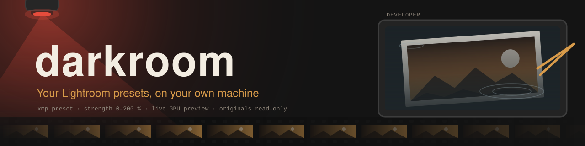
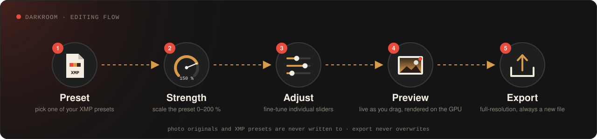
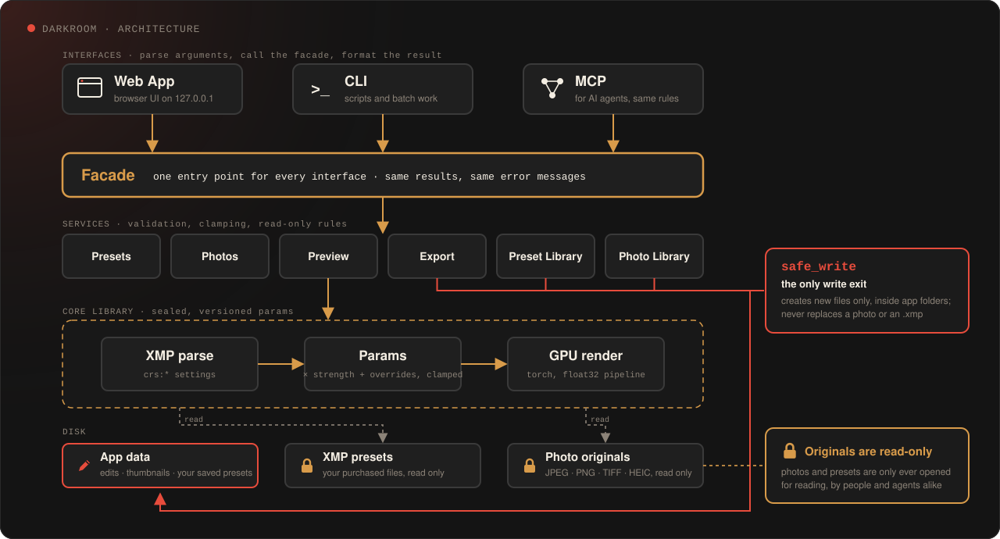

<p align="center">
  
</p>

<p align="center">
  <b>在自己電腦上，用你買的 Lightroom preset 修照片。</b><br>
  挑 preset → 調強度 → 微調滑桿 → 即時預覽 → 匯出。不用訂閱，不上傳雲端。
</p>

---

## 為什麼要做這個

退了 Lightroom 訂閱之後，手上買過的幾百個 XMP preset 就沒地方用了。darkroom 直接讀這些 `.xmp`，把裡面的 Lightroom 設定（曝光、對比、亮部／陰影、HSL、色彩分級、曲線、漸層遮罩……）用 GPU 在本機重算出來，拖滑桿就能即時看到結果。

**讓人省心**是這個工具唯一的目標：你只需要專注在擅長的照片編輯，其他的——檔案、路徑、格式、設定——交給 darkroom。

原則很簡單：**preset 裡寫的設定一律由程式照算；AI 只做程式做不到的事**（看懂畫面、找出位置、重畫內容）。照片原檔和買來的 preset 原檔，darkroom 永遠只讀不寫。

<p align="center">
  
</p>

## 現在能做什麼（第一版／alpha）

| 功能 | 說明 |
|---|---|
| **套 preset** | 解析 Lightroom PV2012 系列 XMP（ProcessVersion 6.7／10.0／11.0／15.4），強度 0～200%，套用時把 Adobe 未公開的部分（清晰度、紋理、去朦朧、亮部陰影）用公開演算法近似 |
| **即時預覽** | torch GPU 渲染，1.5MP 全套運算約 15～20 ms，拖滑桿時只算最新一次 |
| **微調滑桿** | 在 preset 之上逐項加減；可復原／重做；按住看原圖 |
| **讀檔** | JPEG、PNG、TIFF（含 16-bit）、HEIC／HEIF（iPhone，10-bit、Display P3 轉 sRGB）；依 EXIF 自動轉正 |
| **匯出** | 全解析度 JPEG（品質可調）或 16-bit TIFF，嵌入 sRGB 描述檔、保留 EXIF；**永不覆蓋**，同名自動加序號；批次 24MP 約 0.4 秒／張 |
| **preset 庫** | 群組樹、搜尋、最愛、改名、搬移、匯入 `.xmp`、把目前的修改存成自己的 preset——整理只改索引，原檔不動 |
| **照片庫** | 資料夾縮圖格、多選；每張照片的修改自動保存（以照片內容的 SHA-256 對應，搬移改名都不會遺失）；複製／貼上修改；匯出所選 |
| **給 AI 代理用** | CLI（`--json` 輸出固定格式）與 MCP server，和 App 共用同一套操作與錯誤訊息 |

還沒做的：RAW、AI 修圖建議、AI 遮罩、去雜物／美顏、A/B 對照滑桿……見 [路線圖](#路線圖)。

## 需求

- **Windows 10／11**（目前只在 Windows 上開發與測試；macOS／Linux 規劃中）
- **NVIDIA GPU＋CUDA**（開發機是 RTX 4070 Ti SUPER 16GB）
- **Python 3.13**，套件：
  - `torch`（CUDA 版，開發用 2.14.0+cu130）
  - `aiohttp`、`opencv-python`、`numpy`、`Pillow`、`tifffile`
  - `pillow-heif`（選用，讀 HEIC 才需要；開發用 1.8.0）
- **Node.js**（選用，只有跑前端邏輯測試才需要）
- 你自己的 Lightroom `.xmp` preset（darkroom 不附任何 preset）

> 作者的環境是把上面的套件裝在一份獨立的可攜 Python 裡，跟其他 AI 工具（llama.cpp、ComfyUI）放在同一個資料夾；你用一般的 venv 也可以。

## 貼給你的 Agent

用 Claude Code、Codex 或 Cursor 的話，把下面這段整段貼給它，它會照 [安裝教學](docs/agent-install.md) 一步一步裝好、驗證，遇到要你決定的地方（preset 放哪、要不要下載 PyTorch）會先問你：

```text
請幫我安裝 darkroom（https://github.com/TLOGBen/darkroom），一個在本機用 Lightroom XMP preset 修照片的工具。
照 repo 裡的 docs/agent-install.md 從頭做到尾，每一步的 check 通過才往下。
規則：不要寫入或搬動我的照片資料夾和 preset 資料夾；不要動系統的 Python，用 repo 裡的 .venv；
下載大型套件前先問我；preset 資料夾在哪請問我，不要猜。
最後告訴我：裝在哪、Python 與 PyTorch 版本、找到幾個 preset、測試結果、怎麼啟動，以及有沒有註冊 MCP。
```

## 安裝與設定

自己動手的話：

```powershell
git clone https://github.com/TLOGBen/darkroom.git
cd darkroom
py -3.13 -m venv .venv
.\.venv\Scripts\python.exe -m pip install torch==2.14.0 --index-url https://download.pytorch.org/whl/cu130
.\.venv\Scripts\python.exe -m pip install -r requirements.txt
```

（PyTorch 請選你的顯示卡驅動支援的 CUDA 版本；完整步驟與檢查見 [`docs/agent-install.md`](docs/agent-install.md)。）

在 repo 根目錄建一個 `config.local.json`（不進 git），至少告訴 darkroom 你的 preset 在哪：

```json
{
  "preset_dir": "D:/Presets/xmp"
}
```

| 鍵 | 意思 | 沒寫時 |
|---|---|---|
| `preset_dir` | 買來的 `.xmp` 所在資料夾（只讀） | 由 `localllms_root` 推得 |
| `preset_library_dir` | preset 庫索引、匯入與自存 preset 放哪 | `preset_dir` 的上一層 |
| `data_dir` | 照片庫：每張照片的修改、縮圖快取 | `%LOCALAPPDATA%\darkroom` |
| `localllms_root` | 作者自己的模型／執行環境資料夾（一般使用者不需要） | — |

也可以用環境變數 `LOCALLLMS_ROOT`，或在啟動時加 `--preset-dir`／`--data-dir` 覆蓋。

## 啟動

```powershell
# 只綁 127.0.0.1，預設埠 8765，開瀏覽器到 http://127.0.0.1:8765/
.\.venv\Scripts\python.exe -s -m darkroom_app

# 作者環境：tools/start.ps1 會從 config.local.json 找到專用 Python、等伺服器就緒再開瀏覽器
pwsh -File tools/start.ps1
pwsh -File tools/make-shortcut.ps1   # 產生桌面捷徑
```

## 給 AI 代理用：CLI 與 MCP

三個入口（Web App、CLI、MCP）呼叫同一個 facade，同一件事得到同一個結果、同一句錯誤：

<p align="center">
  
</p>

**CLI**——每個子指令加 `--json` 會在 stdout 印恰好一行 `{"ok":true,"result":…}` 或 `{"ok":false,"error":{"kind","message"}}`：

```powershell
python -s -m darkroom_app.cli presets list --query film --limit 5 --json
python -s -m darkroom_app.cli preview D:/Photos/a.jpg --preset <id> --strength 120 > out.jpg
python -s -m darkroom_app.cli export D:/Photos/a.jpg D:/Photos/b.jpg --json        # 不給參數＝用存好的編輯
python -s -m darkroom_app.cli export D:/Photos/a.jpg --resize long_edge=2048 --max-kb 800 --sharpen screen=standard --json
python -s -m darkroom_app.cli capabilities        # 哪些功能被關掉、為什麼
python -s -m darkroom_app.cli edit get D:/Photos/a.jpg --json
```

結束碼：`0` 成功、`1` 未預期錯誤、`2` 參數不對、`3` 找不到、`4` 衝突、`5` 暫時無法使用、`6` 批次裡有部分失敗。

匯出可選 JPEG／PNG／TIFF（8／16-bit）／WebP、JPEG 檔案大小上限、只縮不放的尺寸、中繼資料（全部／只留版權／不含，可移除 GPS）、螢幕／霧面紙／光面紙輸出銳利化，常用組合存成「匯出預設」（`export-presets`）；preset 可以匯出成 Lightroom 讀得到的 `.xmp`（`presets export`，永不覆蓋）。啟動時偵測 GPU、HEIC、WebP、照片庫資料區、preset 庫位置、語意索引與 1Password 登入，偵測不到的功能安靜關掉並說原因（`capabilities`）。

**MCP**——stdio server，33 個 `darkroom_*` 工具（列 preset、預覽會回傳圖片給模型看、套用與保存修改、取回上一份編輯 `darkroom_edit_restore`（CLI `edit restore`）、匯出、匯出預設、preset 匯出成 `.xmp`、能力偵測 `darkroom_capabilities`、preset 語意索引 `darkroom_semantic_build`／`darkroom_semantic_status`…）。註冊到 Claude Code：

```powershell
claude mcp add darkroom -- <你的 python> -s -m darkroom_app.mcp_server
```

## 安全保證

darkroom 會被你自己和 AI 代理操作，所以這幾條是寫成測試守住的，不是口頭承諾：

- **照片原檔、買來的 preset 原檔永遠只讀。** 產品程式只有一個寫檔出口（`safe_write`）：只建新檔、限定在指定資料夾、拒絕寫進 preset 資料夾、拒絕替換或刪除照片與 `.xmp`。
- **匯出永不覆蓋**，同名一律加序號；匯出到照片所在資料夾時，原檔的 SHA-256 前後不變。
- **只綁 127.0.0.1**，而且擋掉「你瀏覽器裡的其他網頁」：檢查 Host、Origin、`Sec-Fetch-Site`、Content-Type，讀照片路徑的請求要帶專用標頭，HTTP 也不收任意寫入路徑。
- **測試全程掛執行期寫檔守門**（Python audit hook）：任何測試只要寫到宣告範圍以外就直接失敗，受保護資料夾前後比對雜湊。

## 路線圖

1. ✅ **第一版（alpha）**：核心函式庫、App、HEIC、三入口分層、匯出、preset 庫、照片庫
2. ⏳ **校正**：用 Lightroom 試用版渲染單一滑桿掃描，把亮部／陰影／白／黑擬合到更接近 Lightroom
3. **小功能**：A/B 對照滑桿、preset 匯出、資料夾位置跟隨各平台慣例、能力偵測（偵測不到的功能自動關閉）
4. **RAW**（`rawpy` 接在同一套運算前）
5. **AI 修圖建議**：本機視覺模型看圖給滑桿數值，程式套用
6. **AI 遮罩**：主體／天空／人物遮罩，preset 只套在遮罩內
7. **自動修圖**：去雜物、美顏與身形滑桿、放大、光線調整

完整的決定紀錄在 [`.claude/wayfinder/darkroom/map.md`](.claude/wayfinder/darkroom/map.md)。

## 開發

```powershell
python -s -m unittest discover -s tests   # 約 390 個測試，GPU 忙碌時計時類會自動跳過
node --test tests/js/test_logic.cjs       # 前端邏輯
python -s tools/bench_preview.py          # 預覽延遲；另有 bench_export / bench_preset_library / bench_photo_library
```

- 用詞：[`CONTEXT.md`](CONTEXT.md)（preset、編輯、照片指紋……每個詞的正式定義）
- 架構決定：[`docs/adr/`](docs/adr/)
- 每一片功能的驗收合約與封緘紀錄：[`.claude/contract/`](.claude/contract/)
- 核心函式庫只公開 7 個名稱（`load_preset`、`Params`、`render`…），App 只透過它們使用核心

## 授權

尚未選定授權條款。在選定之前，保留所有權利。

darkroom 與 Adobe 無關；「Lightroom」是 Adobe 的商標，這裡只用來說明相容的檔案格式。
