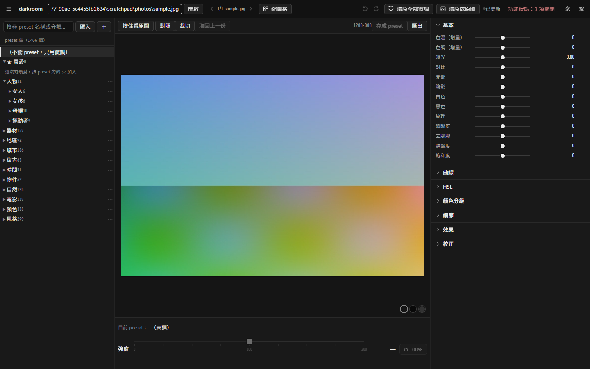

  

  <b>在自己電腦上，用你買的 Lightroom preset 修照片。</b> 
  挑 preset → 調強度 → 微調滑桿 → 即時預覽 → 匯出。不用訂閱，不上傳雲端。

---

## 這是什麼

退了 Lightroom 訂閱之後，手上買過的幾百個 XMP preset 就沒地方用了。darkroom 直接讀這些 `.xmp`，把裡面的 Lightroom 設定（曝光、對比、亮部／陰影、HSL、色彩分級、曲線、漸層遮罩……）用 GPU 在本機重算出來，拖滑桿就能即時看到結果。

**讓人省心**是這個工具唯一的目標：你只需要專注在擅長的照片編輯，其他的——檔案、路徑、格式、設定——交給 darkroom。
原則很簡單：**preset 裡寫的設定一律由程式照算；AI 只做程式做不到的事**（看懂畫面、找出位置、重畫內容）。照片原檔和買來的 preset 原檔，darkroom 永遠只讀不寫。

  

  

## 功能

| 功能 | 說明 |
|---|---|
| **套 preset** | 解析 Lightroom PV2012 系列 XMP（ProcessVersion 6.7／10.0／11.0／15.4），強度 0～200%；Adobe 沒公開的部分（清晰度、紋理、去朦朧、亮部陰影）用公開演算法近似 |
| **即時預覽** | GPU 渲染，1.5MP 全套運算約 15～20 ms；拖滑桿時只算最新一次 |
| **微調滑桿** | 在 preset 之上逐項加減；復原／重做；按住看原圖 |
| **讀檔** | JPEG、PNG、TIFF（含 16-bit）、HEIC／HEIF（iPhone，10-bit、Display P3 轉 sRGB）；依 EXIF 自動轉正 |
| **A/B 對照** | 編輯前／後拖分隔線對照，隨時「還原成原圖」，也能取回上一份編輯 |
| **裁切與旋轉** | 拖框、鎖比例（原始、1:1、4:5、2:3、16:9、自由…）、拉直、轉 90°、鏡像；縮圖、預覽、匯出都套同一個範圍 |
| **匯出** | JPEG（品質或檔案大小上限）、PNG、TIFF（8／16-bit）、WebP；只縮不放的尺寸；中繼資料全留／只留版權／全移除，可單獨拿掉 GPS；輸出銳利化；匯出預設；嵌入 sRGB，**永不覆蓋**；24MP 約 0.4 秒／張 |
| **preset 庫** | 群組樹、搜尋（含 AI 寫的中英文風格標籤）、最愛、改名、搬移、匯入 `.xmp`、把目前的修改存成自己的 preset、匯出成 Lightroom 讀得到的 `.xmp`——整理只改索引，原檔不動 |
| **照片庫** | 資料夾縮圖格、多選；每張照片的修改自動保存（以照片內容對應，搬移改名都不會掉）；複製／貼上修改；匯出所選 |
| **設定** | 設定頁（語言 zh-TW／en-US、資料夾、AI、ComfyUI）、改了立即生效；設定可匯出／匯入 |
| **給 AI 代理用** | CLI（`--json` 固定格式）與 MCP server（38 個 `darkroom_*` 工具，例如取回上一份編輯 `darkroom_edit_restore`／CLI `edit restore`），和 App 共用同一套操作與錯誤訊息 |

偵測不到的功能（CUDA、HEIC、WebP、語意搜尋、ComfyUI…）會自動關掉並說明原因。還沒做的：RAW、AI 修圖建議、AI 遮罩、去雜物／美顏，見 [開發文件的路線圖](docs/development.md#路線圖)。

## 下載安裝

**安裝檔（建議）**：到 [GitHub Releases](https://github.com/TLOGBen/darkroom/releases) 下載 Windows 的 `.msi`／`-setup.exe`，或 Linux 的 `.deb`／`.AppImage`。第一次開啟時會說明要下載 Python 與 PyTorch（有 NVIDIA 顯示卡約 3 GB），**你按同意才下載**，之後就直接進編輯畫面。同一頁還有命令列執行檔 `darkroom`（給 AI 代理或腳本用）。

**從原始碼**：需要 Python 3.13、Node.js 22+、NVIDIA GPU（CUDA）。或者把 [`docs/agent-install.md`](docs/agent-install.md) 交給你的 Claude Code／Codex／Cursor，它會一步一步裝好、遇到要你決定的地方先問你。

兩種方式的完整步驟、GPU／CUDA 說明與疑難排解都在 **[安裝說明](docs/install.md)**。

## 快速開始

[5 分鐘上手](docs/quick-start.md)：第一次啟動 → 指定 preset 資料夾 → 修一張 → 匯出，以及 CLI 與 MCP 各一個例子。

其他文件：[設定](docs/configuration.md)、[架構](docs/architecture.md)、[開發與發版](docs/development.md)、[給 AI 代理的使用手冊](AGENTS.md)、[用詞定義](CONTEXT.md)。

## 安全保證

darkroom 會被你自己和 AI 代理操作，所以這幾條是寫成測試守住的，不是口頭承諾：

- **照片原檔、買來的 preset 原檔永遠只讀。** 程式只有一個寫檔出口（`safe_write`）：只建新檔、限定在指定資料夾、拒絕寫進 preset 資料夾、拒絕替換或刪除照片與 `.xmp`。
- **匯出永不覆蓋**，同名一律加序號；匯出到照片所在資料夾時，原檔前後的 SHA-256 不變。
- **只綁 127.0.0.1**，而且擋掉「你瀏覽器裡的其他網頁」：檢查 Host、Origin、`Sec-Fetch-Site`、Content-Type，讀照片路徑的請求要帶專用標頭，HTTP 也不收任意寫入路徑。
- **金鑰不落地**：AI 功能的金鑰只記 1Password 參照（`op://…`）或讀環境變數，設定檔裡放金鑰本身會被拒絕。
- **測試全程掛寫檔守門**（Python audit hook）：任何測試只要寫到宣告範圍以外就直接失敗，受保護的資料夾前後比對雜湊。

## 授權

[MIT](LICENSE)。darkroom 不附任何 preset；你買來的 preset 依它們原本的授權使用。
