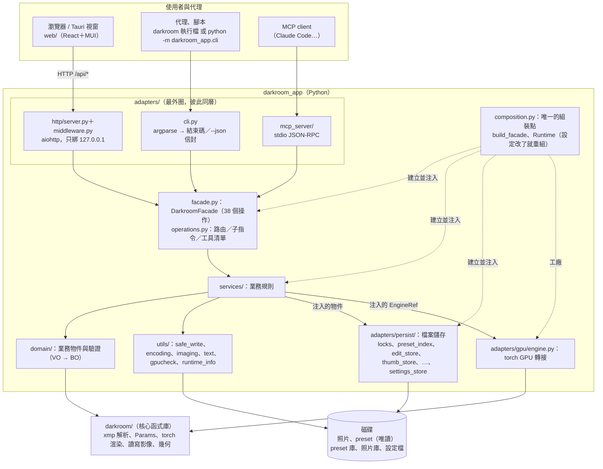
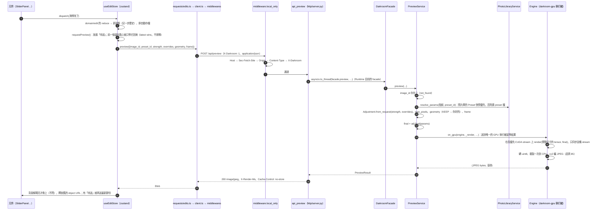
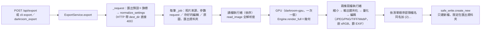
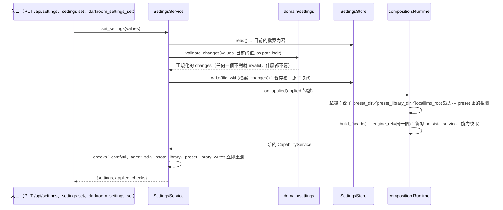
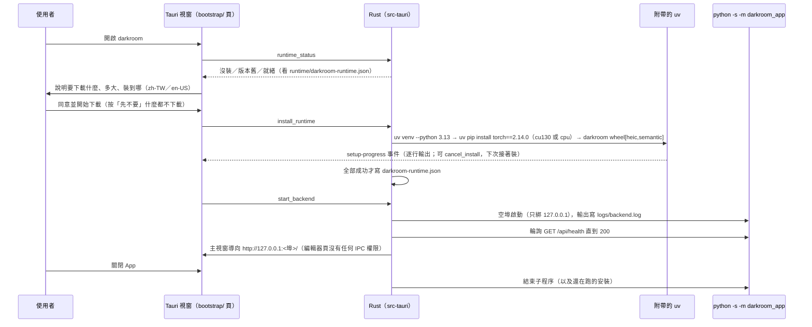

# darkroom 架構

這份描述**現在的程式長什麼樣**（v2，2026-10-10），每一節都對照過實際的程式碼。決策的來龍去脈在 [`architecture/plan-v2.md`](architecture/plan-v2.md)（施工依據，保留做紀錄）與 [`adr/`](adr/)；用詞的正式定義在 [`CONTEXT.md`](../CONTEXT.md)。

> 舊圖 `docs/assets/architecture.svg` 是 v1 的樣子（六個 service、沒有設定、沒有 persist 層），已經過時、README 也不再引用；本文改用 mermaid 圖，以本文為準。

## 1. 全貌



三個入口（HTTP、CLI、MCP）做的事只有「把自己的格式轉成 facade 呼叫、把結果轉回自己的格式」；同一件事得到同一個結果、同一句錯誤（[ADR-0001](adr/0001-interfaces-share-one-facade.md)）。規則都在 facade 之後的 service。

## 2. 分層與依賴規則

依賴只能由外往內：**adapters → facade → services → domain → utils**；`darkroom/` 核心函式庫不認識 `darkroom_app`。`composition.py` 是唯一把物件接起來的地方，`config.py` 只有 composition 與三個入口可以讀。

| 層 | 位置 | 負責 | 不可以 |
|---|---|---|---|
| 入口 adapter | `adapters/http/`、`adapters/cli.py`、`adapters/mcp_server/` | 解析請求、呼叫一個 facade 操作、把結果或 `DarkroomError` 的 kind 轉成 HTTP 狀態碼／結束碼／`isError` | 放規則（不可以自己驗證、夾值、組錯誤句子、列資料夾、算雜湊） |
| facade | `facade.py`、`operations.py` | `Facade` Protocol＋`DarkroomFacade`：每個方法剛好一個 `return` 轉給 service。`operations.py` 只描述每個操作對應的 HTTP 路由、CLI 子指令、MCP 工具名、參數 schema 與 annotations，順序＝MCP 工具順序 | 有任何邏輯 |
| 組裝 | `composition.py`、`config.py` | 讀設定、建 persist store 與 service、把設定值（或零參數函式）注入；`Runtime` 在設定改了時重組 | — |
| service | `services/` | 業務規則：檢查順序、錯誤句子、批次、管線 | import facade、入口、`config`、GPU adapter；自己讀設定；解析 request |
| domain | `domain/` | 業務物件與純規則：`Adjustment`、`Geometry` 驗證、`Settings` 驗證、匯出設定正規化、preset 查詢、錯誤與訊息常數 | 開檔、讀環境變數、import service 或 adapter |
| persist | `adapters/persist/` | 所有 App 自己的檔案：跨程序鎖、原子取代、重試讀、壞檔備份、各資料的 store | import service、facade、composition、config |
| GPU | `adapters/gpu/engine.py` | 開照片成 GPU tensor、預覽渲染＋JPEG 編碼、全解析度渲染；單一 `darkroom-gpu` 執行緒＋高優先 CUDA stream | — |
| utils | `utils/` | 沒有業務知識的工具：`safe_write`（唯一的寫檔出口）、`encoding`（JPEG／PNG／TIFF／WebP 編碼、EXIF、ICC）、`imaging`（縮圖、指紋、預覽尺寸）、`text`、`gpucheck`、`runtime_info` | import `darkroom_app` 其他部分（只例外允許副檔名表 `domain.formats`） |

**這些規則有測試把關**（`tests/test_layering.py`）：`test_dependency_direction` 掃每個模組的 import；`test_controllers_hold_no_rules` 掃入口不能呼叫的函式與名稱；`test_facade_methods_forward_once` 用 AST 確認 facade 每個方法只有一個 `return`；`test_only_safe_write_writes` 確認只有 `safe_write` 會開檔寫入；`test_operation_coverage` 確認 `operations.py` 列的每個路由、子指令、工具都存在。三入口一致性另有 `tests/test_interface_parity.py`（同一個請求從三個入口進來，結果與錯誤句子要逐字相同）。

**相容 shim**：v2 把模組搬到上面的目錄，舊路徑（`darkroom_app.server`、`.cli`、`.engine`、`.presets`、`.preview`、`.errors`、`.messages`、`.sliders`、`.skips`、`.formats`、`.safe_write`、`.encoding`、`.gpucheck`、`.mcp_server`）留成**別名**：檔案裡只有一行 `sys.modules[__name__] = <新模組>`，所以舊的 import 與 `mock.patch("darkroom_app.server…")` 碰到的是同一個模組物件。新程式不要 import 舊路徑（`test_shims_only_alias` 確認 shim 裡沒有函式或類別）。三個執行入口 `-m darkroom_app`、`-m darkroom_app.cli`、`-m darkroom_app.mcp_server` 照舊可用。

### 目錄

```text
darkroom/                    核心函式庫：只公開 load_preset、Params、render、read_image、write_image、Geometry…
darkroom_app/
  __init__.py                __version__（版本的唯一來源）
  __main__.py                App 入口：python -s -m darkroom_app [--port] [--preset-dir] [--data-dir]
  adapters/
    http/server.py           aiohttp 路由、供應 web 建置；middleware.py 本機檢查
    cli.py                   CLI；mcp_server/（__init__ 啟動、protocol.py JSON-RPC、tools.py 工具轉譯）
    persist/                 locks、data_folder、edit_store、thumb_store、preset_index、semantic_store、
                             export_presets_store、settings_store
    gpu/engine.py            Engine
  facade.py  operations.py  composition.py  config.py
  services/                  presets、preset_library、semantic_index、preview、photos、photo_library、
                             export、export_presets、capabilities、settings（__init__：EngineRef、on_gpu）
  domain/                    adjustment、edits、export_options、presets、settings、sliders、skips、formats、
                             sentinels（KEEP）、errors、messages
  utils/                     safe_write、encoding、imaging、text、gpucheck、runtime_info
  （其餘頂層 .py 是相容 shim）
web/                         React 前端（§8）
desktop/                     Tauri 2 外殼、bootstrap 頁、darkroom CLI 執行檔（§9）
tests/                       Python 測試（unittest）；web 的測試在 web/src/**/*.test.ts(x)
```

## 3. VO → BO：原始參數在哪裡變成業務物件

入口拿到的是原始值（JSON body、argparse 結果、MCP arguments）。入口**不判斷**這些值對不對，原樣交給 facade；service 一開始就把它們轉成 domain 物件，不合法就是 `DarkroomError("invalid", <句子>)`，句子一字不改地回到三個入口：

| 原始值 | 轉成 | 在哪裡轉 |
|---|---|---|
| `strength`（0～200 的百分比）＋`overrides`（`{crs 鍵: 差值}`） | `Adjustment` | `domain/adjustment.py` 的 `Adjustment.from_request`；預覽、匯出每一筆、`edit set`、`presets save`、存好的編輯都走它 |
| `geometry`（旋轉、鏡像、拉直、比例、框） | `darkroom.Geometry` | `domain/adjustment.py` 的 `validate_geometry`；沒給（`KEEP`）＝用這張存好的幾何 |
| 匯出設定（格式、位元深度、品質、大小上限、縮小、中繼資料、銳利化） | 正規化後的設定 dict | `domain/export_options.py` 的 `normalize_settings`（匯出預設先合併，旗標明確給的優先） |
| 設定的部分更新 | 正規化後的 `{鍵: 值}` | `domain/settings.py` 的 `validate_changes`：未知鍵先整批拒絕，再逐鍵檢查，全部通過才交給 store 寫 |

最終要渲染的參數只有一個公式（`effective_params`）：`final = clamp(clamp(preset 在該強度的值) + 微調)`。

## 4. 一次預覽請求，從瀏覽器到 GPU 再回來



重點：

- **照片在開檔時就縮成預覽尺寸（長邊約 1.5MP）放在 GPU 上**（`Engine.open`），之後每次預覽只算這張小圖；最多同時開 8 張（LRU）。裁切後畫面不夠細時，改用另外留的 16-bit 細節底圖（約 4 倍像素）。
- 所有 GPU 工作都跑在同一條 `darkroom-gpu` 執行緒（`services.on_gpu`），所以不會有兩個請求同時搶 GPU；HTTP 的 handler 用 `asyncio.to_thread` 呼叫 facade，不卡住事件迴圈。
- 前端只送最新一次：拖滑桿時中間的值會被跳過，不會排一長串請求。
- 錯誤路徑：service 丟 `DarkroomError(kind, 句子)` → HTTP 轉成 400／404／409／503 與 `{"error": 句子}` → 前端 `normalizeError` 包成 `ApiError`，畫面照原句顯示（v2 不翻後端句子）。

## 5. 一次匯出的路徑



- 每一筆的參數來源：給了 `preset_id`／`strength`／`overrides`／`geometry` 任何一個＝用這次給的（`request`）；都沒給＝照片庫裡存好的編輯（`edit`）；沒有存好的＝原圖（`original`）。結果的 `used.params_from` 會寫出是哪一種。
- 同時最多 3 張全解析度影像在記憶體裡（讀了還沒寫完的）。讀檔、GPU、編碼三段重疊，24MP 約 0.4 秒／張。
- 一筆失敗（讀不了、塞不進檔案大小上限…）只有那一筆 `ok: false`，其他照常；CLI 結束碼 6。
- 匯出檔是 service 唯一自己寫的檔（它就是使用者要的成品）；寫入一律經 `safe_write.create_new`，根目錄＝匯出資料夾，並帶入使用中的 preset 資料夾做額外保護。預設資料夾是 `<照片資料夾>/darkroom 匯出`，HTTP 不收 `dest_dir`（只有 CLI／MCP 能指定）。

## 6. 設定立即生效



- **長期跑的程序**（App 的 HTTP 伺服器、MCP server）持有一個 `Runtime`；每個請求開始時拿 `runtime.facade`。重組只是把這個屬性換成新的 facade，所以**正在跑的請求用舊的做完，下一個請求就是新的**，不需要各個 service 自己監聽設定。
- **`EngineRef` 跨重組共用**：GPU 引擎與已開的照片都保留，換設定不會讓畫面上的照片消失。
- CLI 每次執行都重新 `build_facade`，本來就讀最新的設定檔。
- 命令列給的 `--preset-dir`／`--data-dir` 存在 `Runtime` 的參數裡，重組時照樣優先於設定檔。
- 前端在套用成功後呼叫 `invalidateAfterSettings()`，所有伺服器資料（preset 列表、滑桿、能力…）重讀；`language` 由前端立即切換。
- 設定檔只有一個小檔、整檔原子取代，沒有跨程序鎖：兩個程序同時寫，後寫的贏。

## 7. 資料存在哪

| 資料 | 位置 | 誰寫 | 格式與規則 |
|---|---|---|---|
| 照片原檔 | 使用者的照片資料夾 | **永不寫** | 只讀；以內容的 SHA-256（照片指紋）辨認，不以路徑 |
| 買來的 preset | `preset_dir` | **永不寫** | 只讀；子資料夾＝預設群組 |
| preset 庫 | `preset_library_dir`（預設 `preset_dir` 的上一層） | `persist/preset_index.py`、`semantic_store.py` | `library.json`（群組、顯示名稱、最愛；`library.json.lock` 跨程序鎖）、`import/`（匯入的 .xmp 複本）、`user/`（自存 preset）、`semantic.json`（語意標籤，key＝xmp 內容雜湊，改名搬移不重跑） |
| 照片庫 | `data_dir`（預設 `%LOCALAPPDATA%\darkroom` 等） | `persist/edit_store.py`、`thumb_store.py`、`export_presets_store.py` | `edits/{fp[0:2]}/{fp}.json`（這張的編輯，含 Preset 快照與幾何）＋`{fp}.prev.json`（上一份編輯）；`thumbs/{fp[0:2]}/{fp}.jpg`（長邊 256）；`index/{資料夾雜湊}.json`（檔名 → 大小、修改時間、指紋，避免重算雜湊）；`export-presets.json`（匯出預設） |
| 設定檔 | `DARKROOM_CONFIG` → `config.local.json` → 平台設定資料夾 | `persist/settings_store.py` | JSON，`agent.*` 巢狀；見 [設定](configuration.md) |
| 匯出檔 | 匯出資料夾（預設 `<照片資料夾>/darkroom 匯出`） | `services/export.py` 經 `safe_write` | 只建新檔，同名加序號 |
| 受管理執行環境 | `<app local data>/io.github.tlogben.darkroom/` | 桌面 App（Rust） | `runtime/`（venv＋`darkroom-runtime.json` 標記）、`uv/python/`、`uv/cache/`、`logs/backend.log` |

共通的寫檔規則（`adapters/persist/locks.py`＋`utils/safe_write.py`）：

- **`safe_write` 是唯一的寫檔出口**：只在呼叫者給的根目錄裡建新檔或取代自己的檔；拒絕寫進 preset 資料夾；拒絕替換、刪除照片與 `.xmp`。測試期間另有 Python audit hook 守門，寫到宣告範圍外的測試直接失敗。
- JSON 檔一律「暫存檔＋原子取代」；Windows 上有人正在讀時的 `PermissionError` 會短暫重試。
- 讀不了的檔（壞掉的 JSON）在被取代之前先複製一份 `<檔名>.bad-<unix 秒>`，使用者的東西不會無聲消失。
- 跨程序鎖（`<檔>.lock`，Windows `msvcrt`、POSIX `fcntl`）等超過 5 秒就回 `conflict`；持有者當掉時作業系統會自動放鎖。所以 App 開著時 CLI／MCP 照樣能用。

## 8. 前端（`web/`）

React 19＋TypeScript＋Vite＋MUI v7＋Sass（CSS modules）＋i18next。`npm run build` 輸出到 `web/dist`，由 Python 伺服器供應；設計系統說明在 [`web/DESIGN.md`](../web/DESIGN.md)。

```text
web/src/
  main.tsx                 Provider：MUI ThemeProvider（預設深色）、TanStack QueryClientProvider、BrowserRouter
  App.tsx                  路由：/ 編輯頁、/settings 設定頁（其他路徑回 /）；啟動時讀設定、對齊介面語言
  pages/                   EditorPage、SettingsPage
  layouts/                 AppLayout（頂列＋導覽）、EditorLayout（三欄）
  components/              common/、presets/、editor/、library/、export/（依 context 分；設定頁的表單直接在 SettingsPage）
  hooks/                   zustand store 與 React hooks（見下）
  domain/                  前端的業務型別與純函式：preset、edit、geometry、library、export、settings、errors、text
  requests/                client.ts（唯一的 fetch 出口）＋presets、edits、library、exports、settings
  middlewares/             localHeaders（X-Darkroom、Content-Type）、normalizeError（→ ApiError）、latestOnly
  i18n/                    i18next 設定、locales/zh-TW.json、en-US.json（兩份鍵一致，有測試）
  styles/                  theme.ts、_tokens.scss、global.scss
  utils/                   files、storage
```

**狀態管理**：

- **伺服器資料**用 TanStack Query（`hooks/queries.ts`）：唯一的 `QueryClient` 放在模組層，因為 zustand store（非 React 程式）也要讀同一份快取。資料不輪詢、不在視窗聚焦時重抓，由寫入的地方主動失效（`invalidatePresetLibrary()`、`invalidateAfterSettings()`）。
- **UI 狀態**用 zustand，一個領域一個 store：`useEditStore`（編輯狀態＋復原歷史、預覽 latest-wins、A/B 對照、裁切模式）、`useLibraryStore`（開著的照片、資料夾、自動存檔、縮圖格、複製／貼上）、`usePresetStore`（搜尋、展開、整理動作）、`useExportStore`（匯出對話框與執行）、`useLayoutStore`（欄位收合、照片底色）、`useAppStore`（toast、對話框）。
- **自動存檔**（`hooks/autosave.ts`）是沒有 React 的類別：每次改變記下最新一份、定時送出、失敗退避重試一次、換照片／貼上／匯出前先 flush、關頁面時用 keepalive 送出。
- **純規則**放 `domain/`（從 v1 的 `logic.js` 移植，45 個舊案例在 `domain/__tests__/logic.legacy.test.ts` 照樣讀 `tests/cases/*.json`），元件與 store 只呼叫它們。
- **i18n**：所有給人看的字走 `t()`；語言＝設定的 `language` → 瀏覽器語言 → zh-TW。後端的錯誤句子目前是中文原句，前端照原樣顯示。

**開發伺服器**：`npm run dev`（Vite，127.0.0.1:5173）把 `/api` proxy 到後端（預設 127.0.0.1:8765，`DARKROOM_PORT` 可改），並改寫 `Origin`、拿掉 `Sec-Fetch-Site`／`Referer`，後端的本機檢查看起來就跟自己供應頁面時一樣。

**伺服器怎麼供應頁面**（`adapters/http/server.py`）：每次請求依序找有 `index.html` 的建置資料夾：`DARKROOM_WEB_DIST`（有設就只看它）→ `darkroom_app/web_dist/`（wheel 安裝版）→ `<repo>/web/dist`。`/`、`/settings` 等頁面路由回 `index.html`（`no-store`），`/assets/*` 長期快取（檔名帶雜湊），根目錄的 logo 等用 ETag 每次確認。找不到建置時頁面路由回 **HTTP 503** 加一頁中英說明，API 照常。

## 9. 桌面外殼、CLI 執行檔與打包（`desktop/`）



- torch 用哪個來源：`nvidia-smi` 偵測得到 NVIDIA 就用 CUDA 13.0 版，否則 CPU 版。torch 不進安裝檔（GitHub Release 單檔 2 GB 上限）。
- 後端在健康之前就結束時，`start_backend` 失敗並把它最後幾行輸出交給說明頁原樣顯示。**目前沒設 preset 資料夾時 `python -m darkroom_app` 會以結束碼 2 退出**，所以全新安裝要先用 `darkroom settings set preset_dir=…` 或手寫平台設定檔（見 [安裝](install.md#3-指定-preset-資料夾)）。
- `darkroom` CLI 執行檔（`desktop/cli`，crate `darkroom-cli`）：`darkroom <args>` → `python -s -m darkroom_app.cli <args>`；`darkroom mcp` → `darkroom_app.mcp_server`；`darkroom app` → `darkroom_app`；`--version` 印自己的版本。stdio 與結束碼原樣轉傳。Python 的來源：`DARKROOM_PYTHON` → 同一個受管理環境（identifier 與標記檔名跟桌面 App 一致，有測試）；都沒有時結束碼 5。
- **版本只有一個來源**：`darkroom_app/__init__.py` 的 `__version__`。`pyproject.toml`（hatch 動態讀）、`/api/version`、`cli --version` 直接讀它；`tauri.conf.json` 與兩個 `Cargo.toml` 由 `desktop/scripts/sync-version.mjs` 同步（CI 用 `--check` 把關）。
- wheel（`pyproject.toml`，hatchling）同時包 `darkroom` 與 `darkroom_app`；`web/dist` 存在時由 `desktop/scripts/hatch_build.py` 放進 `darkroom_app/web_dist/`。torch 刻意不列依賴（要依機器選 CUDA 或 CPU 版）。
- CI（`.github/workflows/ci.yml`）：Python 測試（Ubuntu＋Windows，CPU 版 torch）＋試打 wheel；web 的 lint／typecheck／test／build；Rust 的版本同步檢查、fmt、clippy、test。發佈（`release.yml`）見 [開發：發版](development.md#發版)。

## 10. 跟 bounded context 的對應

領域切成五個 context（[ADR-0005](adr/0005-bounded-contexts.md)），後端模組、前端資料夾都照它分：

| Context | 後端 service | domain | persist | 前端 domain／requests／components／store |
|---|---|---|---|---|
| Preset 庫 | `presets.py`、`preset_library.py`、`semantic_index.py` | `presets.py`、`skips.py` | `preset_index.py`、`semantic_store.py` | `preset.ts`／`presets.ts`／`presets/`／`usePresetStore` |
| 編輯（調色＋幾何） | `preview.py` | `adjustment.py`、`sliders.py` | —（編輯的儲存是照片庫的事） | `edit.ts`、`geometry.ts`／`edits.ts`／`editor/`／`useEditStore` |
| 照片庫 | `photos.py`、`photo_library.py` | `edits.py` | `data_folder.py`、`edit_store.py`、`thumb_store.py` | `library.ts`／`library.ts`／`library/`／`useLibraryStore` |
| 匯出 | `export.py`、`export_presets.py` | `export_options.py`、`formats.py` | `export_presets_store.py` | `export.ts`／`exports.ts`／`export/`／`useExportStore` |
| 設定與能力 | `settings.py`、`capabilities.py` | `settings.py` | `settings_store.py` | `settings.ts`／`settings.ts`／`pages/SettingsPage.tsx`（沒有另開 `components/settings/`） |

跨 context 共用的只有 `domain/errors.py`、`messages.py`、`sentinels.py`；入口與核心函式庫 `darkroom/` 不屬於任何 context。上下游關係（Preset 快照是防腐層、照片庫照抄編輯的模型、設定只經 composition 往下傳）寫在 ADR-0005。

## 11. 跟 plan-v2 不一樣的地方

施工時照 plan-v2 做，以下是實際程式跟計畫有出入、讀程式時要知道的：

| 計畫寫的 | 實際 | 原因 |
|---|---|---|
| hooks 叫 `usePreview`、`useEdit`、`useSettings`… | 狀態放在 `use*Store`（zustand）；伺服器資料的 hooks 集中在 `hooks/queries.ts`（`useSettings`、`usePresets`…）；預覽的 latest-wins 在 `useEditStore` | 從 v1 `app.js` 搬過來時以領域 store 為單位，行為不變 |
| `components/` 有 `settings/` 子資料夾 | 設定頁的表單直接寫在 `pages/SettingsPage.tsx` | 目前只有一頁用到，還不需要拆 |
| 頁面只從 `web/dist` 供應 | 另外找 `DARKROOM_WEB_DIST` 與 `darkroom_app/web_dist/` | wheel 安裝版沒有 `web/` 資料夾；測試要固定的頁面 |
| `cli --version` | `--version` 只印版本號；另有 `version` 子指令回完整的 `{version, python, torch, cuda, platform}` | 跟 HTTP／MCP 的版本操作一一對應 |
| `agent.model` 立即生效 | 會存、會驗證，但目前沒有程式使用；語意索引依合約固定 `claude-haiku-5-5` | 給之後的 AI 助理用 |
| 沒設定也能進設定頁 | `python -m darkroom_app` 沒有 preset 資料夾時直接結束（結束碼 2）；只有 CLI 的 `settings`／`version` 與 MCP 的設定工具能在沒設定時用 | 桌面版改由 bootstrap 頁補上：啟動後端前先問 `preset_setup_status`，沒有可用的 preset 資料夾就用資料夾選擇視窗（tauri-plugin-dialog）挑一個，透過受管理 Python 的 `darkroom_app.cli settings set preset_dir=…` 寫進設定檔；Web App 本身仍要先有 preset 資料夾 |
